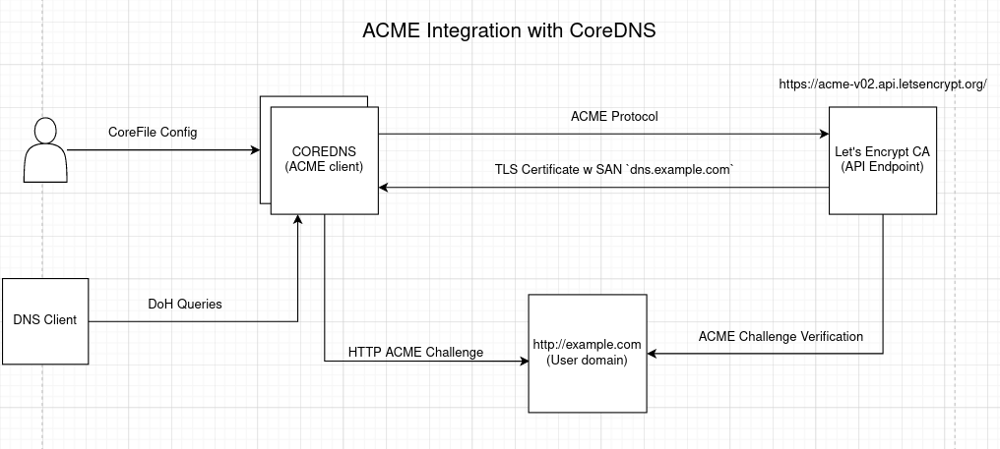

# ACME Support in CoreDNS

| Status        | Proposed       |
:-------------- |:---------------------------------------------------- |
| **RFC #**     | [NNN](https://github.com/coredns/rfc/pull/NNN) (update when you have RFC PR #)|
| **Author(s)** | Jimil Desai (@[jimil749](https://github.com/jimil749))|
| **Sponsor**   | Yong Tang (@[yongtang](https://github.com/yongtang)), Miek Gieben (@[meikg](https://github.com/miekg)), Paul Greenberg ([@greenpau](https://github.com/greenpau))|
| **Updated**   | 2021-03-23                                           |
| **Obsoletes** |  |

## Objective

This project aims to add ACME protocol support to CoreDNS. This project would help automate the process of certificate management via CoreDNS and remove the necessity to manage certificates for CoreDNS instances.

## Motivation and Scope

Currently CoreDNS supports DNS over HTTPS, which is a protocol for performing DNS resolution via the HTTPS protocol. This provides a secure mechasim to serve DNS by preventing eavesdropping and manipulation of DNS data. CoreDNS can serve DNS over HTTPS out of the box but for that to happen it requires users to manaully set up and manage the certificates used to serve DoH. There is no out-of-box certificate retrievel and management provided by CoreDNS. Hence it is upto the users to manage the certificate lifecycle.

The process of managing certificates may sound like a trivial issue initially but in a real production environment it is more complicated and can be really painful. In sizable environment, multiple DNS servers are deployed and operated by multiple parties for different purposes. Even one expired certificate on those servers can cause the production services to fail. Managing certificates on all of those servers can be a daunting task even for an experienced engineer. Therefore it makes sense to automate this process of handling certificate and have certificate management with minimum human interaction to reduce errors and unnecessary service failures.

The [ACME](https://tools.ietf.org/html/rfc8555) Protocol can come in handy here as it is designed to automate the process of verification and certificate issuance. Moreover, it also provides facilities for other certificate management functions such as certificate revocation. Thus adding a new `acme` plugin into CoreDNS to automate the certificate management can remove the need to manually perform these tasks.

### Deliverables

- At the end of the LFX internship period, I would add a new `ACME` plugin to CoreDNS which enables certificate issuance and management
    - This plugin would be defined inside the `https` server block, within the tls directive in the Corefile to setup and manage the certificates for DoH
- Documentation for the plugin explaining the configurations and usability. 


## Design Proposal

Adding a new `ACME` protocol to CoreDNS largely involves following tasks to be performed (Each task is explained in detail below):

- Implementing ACME Protocol pertaining to [RFC 8555](https://tools.ietf.org/html/rfc8555)
    - This involves solving one of the following ACME challenges:
        - HTTP01 Challenge
        - DNS01 Challenge
- Storing the certificate obtained via acme to local available storage.
- Using the obtained certificate to serve DNS over HTTPS.
- Certificate distribution (in case of clustered environment with multiple CoreDNS instances).

Each task mentioned above is explained with substantial details below:

### ACME Protocol with Let's Encrypt

Traditionally, to enable HTTPS on a server one needs to get a certificate from a Certificate Authority(CA). CA is an independent entity that issues certificates to organizations. **Let's Encrypt** is one such CA. The speciality of Let's Encrypt is that it is free, automated and open certificate authority that provides x.509 certificates for TLS at no charge. Let's Encrypt uses ACME to provide certificates which automates the process. Therefore it makes sense to use Let's Encrypt as the CA for CoreDNS acme client to obtain certificates.

### How it works

The objective of Let's Encrypt and `ACME` is to make it possible to set up an HTTPS Server and have it automatically obtain a browser-trusted certificate. This can be accomplished by running a certificate management agent on the required server.

LE allows clients to request certficate management actions using a set of JSON messages carried over HTTPS. Issuance using ACME resembles a traditional CA's issuance process, wherein a user/agent creates an account, requests a certificate and proves control of the domain in that certificate in order for the CA to issue the certificate.

The first phase of ACME is for the client to request an account with the ACME server(Let's Encrypt in our case). The client generates an asymmetric key pair and requests a new account. The creation request is signed with the generated private key to prove that the client controls it. The server then responds with an Account URL and Account Object indicating that the account is registered with the server. Once an account is registered, there are 4 major steps the client needs to take to get a certficate:

1. Submit an order for a certificate to be issued. (Contains the domain for which we require the cert)
2. Prove control of domains requested in the certificate
3. Finalize the order by submitting a CSR
4. Await issuance and download the issued certificate

Overview of ACME

```
Client                              Server

[Contact Info]
[ToS Agreement]
[Additional data]
Signature           ----------->   Account URL 
                    <----------    Account Object

                ACCOUNT CREATION
```


```
Client                                      Server

[Order]
Signature           ----------->
                    <----------             Required Authorizations (Challenges)

[Responses]
Signature           ----------->  
                <-------Validation------->

[CSR]
Signature           ----------->            Acknowledgement
                    <-----------
            <-------Await Issuance------->

[POST as GET Request] ----------->          Certificate
Signature             <---------

            CERTIFICATE ISSUANCE
```

To get a more fine grained understanding of how Let's Encrypt issues certificates via ACME, I will consider an example of setting up `https://example.com/` with an agent running on the web server.

Broadly, there are 2 steps to the process:
- Agent proves to the CA that the web server controls a domain
- Agent (after proving) can request, renew, and revoke certs for that domain

The first time the agent interacts with LE, it generates a new key pair and proves to the CA that the server controls one or more domain. To kick off the process, the agent first asks the LE CA what it needs to do in order to prove that it controls `example.com`. Then the CA will look at the domain name being requested and issue one or more sets of challenges. There are a couple of ways through which the agent can prove control of the domain. These are also called "ACME Challenges" (more on these later):

- Provisioning a DNS record under `example.com`
- Provisioning an HTTP resource inder a well-known URI on `http://example.com/`

Also, along with these challenges, the Let's Encrypt CA also provides a nonce that the agent should sign with its private key pair to prove that it controls the key pair.

<p float="left" align = "center">
  
</p>


After the completing one of the required challenges and signing the nonce with its private key, the agent notifies the CA that it's ready to complete validation. Then the CA validates that the challenges have been satisfied and vertifies the signature on the nonce. If the signature over the nonce is valid and the challenges check out, then the agent(identified by the public key) is authorized to do certificate management for `example.com`.

<p float="left" align = "center">
  
</p>

Once the agent has authorization, requesting, renewing and revoking certificates is as simple as sending certificate management messages signed with the authorized key pair. To obtain a certificate for the required domain the agent constructs a [Certificate Signing Request](https://tools.ietf.org/html/rfc2986) asking the CA to issue certificate. CSR needs to signed with a private key (corresponding to the public key in the CSR) and also with the authorized key so that the CA know it's authorized. CA verifies both the signatures and if everything turns out to be ok, it issues a certificate with public key from the CSR and returns it to agent.

### ACME Challenges 

As mentioned above in order to obtain certificates from Let's Encrypt, the acme agent/client needs to perform some "challenges" which are then validated by the CA before issuing the certificates

#### HTTP-01 Challenge

In order to fulfill this challenge, the client needs to put up a file on the web server (which requires the certificate) at http://DOMAIN/.well-know/acme-challenge/TOKEN, where TOKEN is the token provided by the CA. That file contains the token plus a thumbprint of the account key. Once the ACME client tells the CA that the file is uploaded CA tries retrieving it. If the validation checks get the right responses from your web server, the validation is considered successful and certificate can be issues. Else, one needs to try again with a new certificate.

Note: This challenge requires port 80 on the web server to be open and would not function otherwise.

#### DNS-01 Challenge

This challenge asks one to prove that they control the DNS for the domain name by putting a specific value in a TXT record under that domain name. After obtaining a token, agent/client needs to create a TXT record derived and the account key, and put that record at `_acme-challenge.<DOMAIN>`. Then CA will query thhe DNS system for that record. If it matches, certificates can be issued. Since, the sole purpose of using ACME is automate the certificate renewal and issuance it only makes sense to use DNS-01 challenges if the DNS provider has an API to update records. This challenge can come in handy when port 80 is not available. It also allows issuing wildcard certificates.

### CoreDNS Integration

The major task of this project is to integrate the above defined specs of ACME protocol into CoreDNS so that it could automate certificate management. 

In current scenorios, in order to enable DNS over HTTPS users have to manually provide certificates via the following Corefile configurations:
```
https://example.com {
    tls mycert.pem mykey.pem
}
```
In order to automate this, a fully-compliant RFC 8555 implementation needs to be integrated into CoreDNS, which can automate this task for us. Writing an entire RFC 8555 complaint acme client can be a cumbersome task. At same time there are numerous acme client libraries already implemented in many languages. One such client library is [acmez](https://github.com/mholt/acmez), an acme client library written in GO. We can leverage this library to implement acme.


To add this functionality I propose to add a new plugin `acme`, which performs the acme protocol under the hood and provisions new certificates. This would be based on `acmez`, which would perform low level RFC implementations. 

ACMEZ is an acme client for getting the certificates, not **managing** certificates. Moreover, the `acmez` package is "bring your own solver", which essentially means that the acme challenges should be solved in order to get the certificates.

ACMEZ can help us implement low level ACME protocol, but the major roadblock here would be have a valid domain for which the certificate is issued. In order to perform ACME, the DNS server needs to own a valid domain(which would be eventually used in solving ACME challenges.) Hence, a hard requirement for user to use CoreDNS for ACME, is to own a valid domain name. So for ex: if one owns a domain of `example.com`, this domain would be used to perform ACME challenges (HTTP/DNS) and allow us to issue certificate with required SANs (which could be `dns.example.com`). This subdomain of `dns.example.com` can be then used for serving DoH, i.e for all the subsquent queries the CoreDNS instance would use cert with SAN of `dns.example.com` to serve DoH. This certificate would be obtain using the original domain of `example.com`.

The new configuration/Corefile for using acme for certificate management would be the following:
```
https://example.com {
  tls {
    acme <DOMAIN_YOU_OWN> {
      challenge <CHALLENGE_TYPE>
      email <EMAIL_ID>
    }
  }
}
```

The above Corefile server block configures CoreDNS to serve DoH for all queries matching `example.com`. The `tls` block contains an `acme` label followed by a valid domain name. This domain name is used to perform ACME challenges and issue the certificate. 

Let's Encrypt's issuance policy allows for up to 100 names per certificates. Hence, certificate with the required SAN can easily be minted using a valid domain. 

### ACME Challenges (CoreDNS)

Whenever one gets a certificate from Let's Encrypt, the LE Servers validate that the issuing party controls the domain names in the certificate using acme "challenges". 

#### HTTP Challenge

In order for the coreDNS acme agent to solve the HTTP-01 challenge, following requirement should be fulfilled:
1. Server (Domain owned by the user) should be reachable from public internet
2. Control over port 80

For HTTP-01 challenge, the acme client (CoreDNS, in this case), puts a file on the web server at `http://<YOUR_DOMAIN>/.well-known/acme-challenge/<TOKEN>`, wherein `<TOKEN>` is provided by Let's Encrypt. Therefore, the web server should be accessible to the public internet with open port 80.

CoreDNS ACME client can use HTTP-01 challenge to mint certificates with required SAN, using the domain owned by the user. This certificate can be stored locally and be used for serving DNS over HTTPS requests.

Configurations:
```
https://example.com {
  tls {
    acme <DOMAIN_YOU_OWN> {
      challenge http
    }
  }
}
```

#### DNS Challenge

To solve the DNS challenge, the CoreDNS acme client puts a specific value in a TXT recored under the owned domain name. After Let's Encrypt gives the ACME client a token, the client needs to create a TXT record derived from the token and the account key and put that record at `_acme-challenge.<YOUR_DOMAIN>`. 

Since the main aim is the automation of issuance and renewals of certificate, the DNS-01 challenge is only suited when if the DNS provider has an API which could be used to automate updates. The API can be used to programmatically provision a TXT record under the required domain. The configurations can be passed through the Corefile:

```
https://example.com {
  tls {
    acme <DOMAIN_YOU_OWN> {
      challenge DNS {
        /* DNS Specific configurations */
      }
    }
  }
}
```


### Storage

After successfully solving the ACME challenge, and recieving the required certificate from the CA, the next task is to store the certificate for further usage. Since, the certificate is to be used for serving DNS over HTTPS, it makes sense to store the certificate as [CERT](https://tools.ietf.org/html/rfc4398) Resource Record in the zone file. CERT RR provide a space in the DNS for certificates and related certificate revocation lists. Whenever a DNS (DoH) query hits the CoreDNS server, the server can fetch the required certificate from the zone file and use it to serve DoH. The certificates can be stored under a well-known domain (`dns.coredns.io`). This is significant in case of clustered environment i.e architecture having more than one instance of coredns running. This provides an effective way of sharing the certificates among multiple CoreDNS instances.

Another plausible alternative to storing certificates is using TXT records. Instead of storing tls certificates as CERT RR, they can be stored as TXT Records under a well-known domain (`dns.coredns.io`) and can be used for serving DoH.

### Renewal

Certificates provisioned from Let's Encrypt are valid for 90 days. Let's Encrypt recommend renewing certificates automatically when they have a thired of their total lifetime left. Hence for the current 90 day certificates, ideally the certificates should be renewed within 30 days before expiration. 

In order for CoreDNS to renew certificates in due time, it has to constantly keep a check on the certification expiration date. The CoreDNS `reload` plugin can be effectively leveraged to keep a check on the cert record in the zone file. The reload plugin periodically checks if the Corefile has changed. The reload plugin can "tweaked" and in addition to the Corefile checks it does now, it can also check for certificate expiration date (of the certifcate stored in the zone file as CERT RR/TXT RR). If the certificate expiration time is less than 30 days, the coredns instance should again initiate certificate renewal process from the Let's Encrypt CA. ACME challenges (DNS/HTTP) needs to be solved once again for renewal process. 

### Clustered Environment (Cert Sharing)

In clustered environment, where there are multiple CoreDNS instances running, certificate sharing is a major concern. Certificate sharing is important as it is not feasible for each CoreDNS instance to fetch certificate individually. 

One plausible solution to the problem of cert sharing can be to configure CoreDNS instances as "master" and "worker". 

1. Master: In a cluster, a single DNS Server can be configured as "master", which would be responsible for actually performing ACME challenges and obtaining certificate from the Let's Encrypt CA. The Master would then store the certificate in the zone file as CERT RR under the domain of `dns.coredns.io`. This certificate can be used to serve DoH whenever there is a DNS query to the master.

2. Worker: Worker DNS Server is responsible for fetching the certificates from the Master. The worker is not responsible for performing ACME challenges. Whenever a DNS query is recieved at the worker node, the worker first queries the master for the certificate. Workers should then cache the certificate and use it for further DoH queries.

Configurations:

Master
```
https://example.com {
  tls {
    master
    acme <DOMAIN> {
      challenge <HTTP/DNS Challenge>
      /* challenge spec */
    }
  }
}
```

Worker
```
https://example.com {
  tls {
    worker

  }
  cache
}
```

The worker server caches the CERT RR (for X seconds) for further use to prevent quering the master every time for certificate.

#### Cert Renewal in Clustered Environment

In order to prevent the worker CoreDNS instances from using the stale certificates, it is also important for the workers to have the latest/renewed version of the certificate everytime the master renews the certificate. The master is required to disseminate the certificate to the worker machines. Instead of the workers polling the master every X time interval for the certificates, the master can "NOTIFY" the worker and transfer the new certificate to the worker, every time renewal takes place. This way we can prevent serving stale certificates.

### Architectural Overview

<p float="left" align = "center">
  
</p>


Reiterating the flow, following steps needs to perform for integrating ACME with CoreDNS:

1. Implement ACME plugin using acmez (which performs low level acme protocol).
2. Store the certificate obtained from Let's Encrypt into zone file as CERT/TEXT RR.
3. Use the certificate to serve DoH queries.
4. Renew the certificate (30 days prior to the expiration date)

For Clustered environment:

1. Configure a "master" that performs ACME.
2. Store the certificate in its dns records as CERT RR>
3. Configure other dns instances to query the certificate from master to serve DoH. 
4. After Certificate Renewal, the master should NOTIFY the workers about the new renewed certificate and transfer the new certificate to prevent serving stale certificate.

## Questions and Discussion Topics
Challenges, tls-alpn-01?
I am a bit unsure about the "renewal" and "clustering" part, any comments/thoughts on that would be appreciated. 


