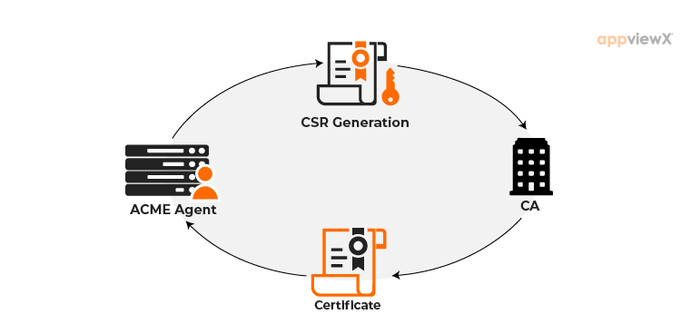

# Title of RFC

| Status        | (Proposed / Accepted / Implemented / Obsolete)       |
:-------------- |:---------------------------------------------------- |
| **RFC #**     | [12](https://github.com/coredns/rfc/pull/12) |
| **Author(s)** | Zhi Wei Chin(@[chinzhiweiblank](https://github.com/chinzhiweiblank)) |
| **Sponsor**   | Yong Tang (@[yongtang](https://github.com/yongtang)), Paul Greenberg (@[greenpau](https://github.com/greenpau)) |
| **Updated**   | 2021-06-05                                       |
| **Obsoletes** | |

## Objective

This project idea aims to add ACME protocol support for certificate management with DNS.

## Motivation and Scope
Currently CoreDNS supports DNS over HTTPS, which is a protocol for performing DNS resolution via the HTTPS protocol. However, there is no out-of-box certificate management provided by CoreDNS. Hence it is up to the users to manage the certificate lifecycle.

### Manual Certificate Management
To generate a TLS/SSL certificate, you need to do the following:
1. Generate a Certificate Signing Request (CSR)
2. Cut and paste the CSR into a Certificate Authority's (CA) web page
3. Prove ownership of the domain(s) in the CSR through the CA's challenges
4. Download the issued certificate and install it on the user's server

Managing certificates manually poses a risk to systems in production because:
1. Users can forget to renew certificate until expiration
2. Risk of exposure leads to gaps in ownership and hence Man-in-the-Middle attacks and breaches.

ACME allows automatic renewal, replacement and revocation of domain validated TLS/SSL certificates. Thus adding a new ACME functionality into CoreDNS automates the manual process of certificate management and removes these risks.

## Deliverables
- To create a plugin that is able to perform ACME and deal with the following challenges:
    - HTTP01
    - DNS01
    - TLS-ALPN-01
- The plugin should work in clustered environments i.e. multiple DNS servers

## Concepts
### ACME Protocol

#### Domain Validation


* Server generates key-value pair: a public and private key. Server keeps private key
* Certificate Authority (CA) issues one or more challenges to prove that the server controls the domain.
* CA also provides an arbitrary number (a nonce) to sign with the private key. This proves that it controls the key-value pair.
* Server fulfills the challenge and signs the provided nonce.
* CA verifies the nonce and checks if the challenge is fulfilled.
* Server is authorised to do certificate management for the domain with the key-value pair. The key-value pair is now known
as the **authorised** key-value pair.

#### Certificate Issuance


* Server generates a Certificate Signing Request and a public key. It asks the CA to issue a certificate with this public key.
* Server signs the public key in the CSR and the CSR with the **authorised** private key.
* CA verifies both signatures and issues the certificate.
* Server receives the certificate and installs it on the relevant domain.

Likewise, for revocation, a revocation request is generated and signed with the **authorised** private key. It is then sent to the CA to revoke the certificate.

### Challenges

### HTTP01 Challenge
This requires port 80.

CA gives the ACME client a token which puts a file on the server at http://<YOUR_DOMAIN>/.well-known/acme-challenge/<TOKEN>. The file contains the token, plus a thumbprint of your account key. Once the client tells the CA that the file is ready, Let’s Encrypt tries retrieving it. If the validation checks get the right responses from the web server, the validation is considered successful and the certificate can be issued.

### DNS01 Challenge
After the CA gives the ACME client a token, the client will then create a TXT record derived from that token and your account key, and put that record at _acme-challenge.<YOUR_DOMAIN>. The CA queries the DNS system for that record and the certificate can be issued if it matches.

However, to do this automatically, the DNS provider needs to offer an API by which changes can be made to domain names. Wildcard certificates can be issued with this challenge.

### TLS-ALPN Challenge
This requires port 443.

It works by providing a special certificate using a standard TLS extension, Application Layer Protocol Negotiation (ALPN), having a special value. This is the most convenient challenge type because it usually requires no extra configuration and uses the standard TLS port which is where the certificates are used.

## Design Proposal

### CoreDNS Integration

The major task of this project is to integrate the above defined specs of ACME protocol into CoreDNS so that it could automate certificate management. 

In current scenarios, in order to enable DNS over HTTPS users have to manually provide certificates via the following Corefile configurations:
```
https://example.com {
  tls mycert.pem mykey.pem
}
```

I propose an `acme` plugin.

I propose to either use [acmez](https://pkg.go.dev/github.com/mholt/acmez) to implement ACME and write the solvers from scratch, or use the solvers in [CertMagic](https://github.com/caddyserver/certmagic) which already deal with the different challenges. Both are written in Go and fully-compliant with ACME.
acmez is only for getting certificates, not managing them. Thus, we still have to write the logic for managing the certificates if we use purely acmez.

ACMEZ can help us implement low level ACME protocol, but the major roadblock here would be to have a valid domain for which the certificate is issued. In order to perform ACME, the DNS server needs to own a valid domain.

For example, if one owns a domain of `example.com`, this domain would be used to perform ACME challenges (HTTP/DNS) and allow us to issue certificate with required SANs (which could be `dns.example.com`). This subdomain of `dns.example.com` can be then used for serving DoH, i.e for all the subsquent queries the CoreDNS instance would use cert with SAN of `dns.example.com` to serve DoH. This certificate would be obtain using the original domain of `example.com`.

The new configuration/Corefile for using acme for certificate management would be the following:
```
https://example.com {
  acme <domain_name> {
    challenge <challenge_type> /* (http01|dns01|tlsalpn)*/
  }
}
```

The above Corefile server block configures CoreDNS to serve DoH for all queries matching `example.com`. The `tls` block contains an `acme` label followed by a valid domain name. This domain name is used to perform ACME challenges and issue the certificate.

#### Storage

After successfully solving the ACME challenge, and recieving the required certificate from the CA, the next task is to store the certificate for further usage. Since, the certificate is to be used for serving DNS over HTTPS, it makes sense to store the certificate as [CERT](https://tools.ietf.org/html/rfc4398) Resource Record in the zone file. CERT RR provide a space in the DNS for certificates and related certificate revocation lists. Whenever a DNS (DoH) query hits the CoreDNS server, the server can fetch the required certificate from the zone file and use it to serve DoH. The certificates can be stored under a well-known domain (`dns.coredns.io`).

Another plausible alternative to storing certificates is using TXT records. Instead of storing tls certificates as CERT RR, they can be stored as TXT Records under a well-known domain (`dns.coredns.io`) and can be used for serving DoH.

### Clustered Environment

This could be put into another separate plugin like `acme-worker` and `acme-leader`. However, I propose for it to stay under the `acme` plugin
because it would share the code and logic needed for `acme`.

In clustered environment, where there are multiple CoreDNS instances running, certificate sharing is a major concern. Certificate sharing is important as it is not feasible for each CoreDNS instance to fetch certificate individually.

Since high availability is not a concern, a solution is to configure CoreDNS instances as "leader" and "worker". 

1. Leader: In a cluster, a single DNS Server can be configured as "leader", which would be responsible for actually performing ACME challenges and obtaining certificate from the Let's Encrypt CA. The leader would then store the certificate in the zone file as CERT RR under the domain of `dns.coredns.io`. This certificate can be used to serve DoH whenever there is a DNS query to the master.

2. Worker: The worker is responsible for fetching the certificates from the master. The worker is not responsible for performing ACME challenges. Whenever a DNS query is received at the worker node, the worker first queries the master for the certificate. Workers should cache the certificate and use it for further DoH queries.

Configurations:

Leader
```
https://example.com {
  acme <DOMAIN> {
    challenge <HTTP/DNS Challenge>
    leader
  }
}
```

Worker
```
https://example.com {
  acme <DOMAIN> {
    worker
  }
}
```

The worker caches the CERT RR (for X seconds) to reduce querying the master for the certificate every time a DNS query is received.

#### Cert Renewal in Clustered Environment

In order to prevent the workers from using the stale certificates, the master disseminates the renewed certificate to them instead of workers polling the master for the certificates.

## Timeline
Due to the tight timeline, 50% of the project has to be implemented by July 11th.
Period: June 1st - August 31st

**31 May - 6 June**
1. Approval of RFC
2. Setting up of development environment
3. First Meeting
4. After approval of RFC, start of writing

**7 June - 20 June**
1. Develop code to perform ACME, its basic functionality, along with documentation and tests

**21 June - 5 July**
1. Develop code to handle HTTP01 and DNS01 Challenges, along with documentation and tests

**6 July - 25 July**
50% implementation done by 11 July
1. Initial implementation of master and workers
2. Creation of the clustered environment for development and testing

**26 July -  15 August**
1. Implementation of certificate renewal
2. More rigorous testing of clustered implementation

**16 August - 31 August**
1. Buffer period
2. Cleanup
3. Finish writing the final report

## Questions and Discussion Topics

1. How should I configure the workers to look for the master? When the certificate is renewed, how does the master know where the workers are and how to send the certificate to them?
2. Where should I store the certificate and public-private key pair? Or I can just let the library decide?
3. Any idea about certificate renewal? The previous RFC mentioned changing the `reload` plugin to watch the expiration of the CERT RR.
4. Do I need to add the cache feature for workers or is it something already included in the TLS plugin?
5. Do coredns have a domain for testing and development? I have to try using ACME with a CA.

## References
1. Previous [RFC](https://github.com/coredns/rfc/pull/11/files)
2. [DNS Challenge Types](https://letsencrypt.org/docs/challenge-types/)
3. [Explanation of ACME Protocol](https://www.thesslstore.com/blog/acme-protocol-what-it-is-and-how-it-works/)
4. [ACME RFC](https://tools.ietf.org/html/rfc8555)